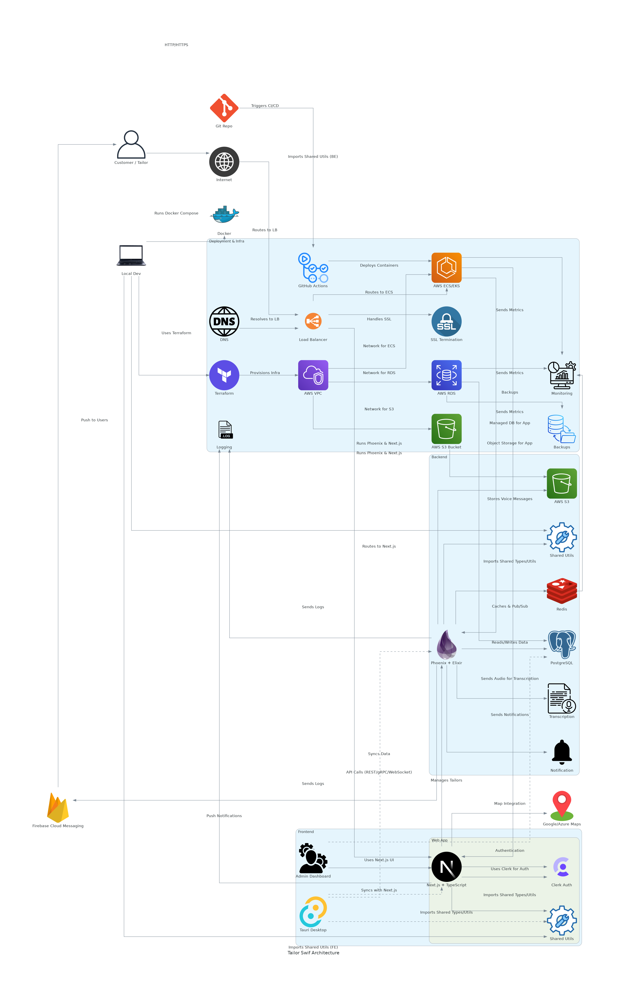

[](https://github.com/gongahkia/tailor-swif/releases/tag/1.0.0) 

# `Tailor Swif`

Full Stack Web App that connects [tailor](https://dictionary.cambridge.org/dictionary/english/tailor)s and their [client](https://www.reddit.com/r/askSingapore/comments/1cm3f25/affordable_tailor/)s.

Made mainly to learn [this stack](#stack). My takeaways can be found [here](#takeaways).

## Stack

* *Frontend*: [Next.js](https://nextjs.org/), [TypeScript](https://www.typescriptlang.org/)
* *Backend*: [Phoenix](https://www.phoenixframework.org/), [Elixir](https://elixir-lang.org/), [Ecto](https://hexdocs.pm/ecto/)
* *DB*: [PostgreSQL](https://www.postgresql.org/)
* *Cache*: [Redis](https://redis.io/)
* *Auth*: [Clerk](https://clerk.com/), [JWT](https://jwt.io/introduction), [Bcrypt](https://clerk.com/blog/bcrypt-hashing-authentication-encryption)
* *Deployment*: [AWS EC2](https://aws.amazon.com/ec2/), [AWS RDS](https://aws.amazon.com/s3/), [AWS S3](https://aws.amazon.com/s3/), [Terraform](https://developer.hashicorp.com/terraform), [AWS CloudFormation](https://docs.aws.amazon.com/AWSCloudFormation/latest/UserGuide/Welcome.html)
* *Package*: [Docker](https://www.docker.com/)
* *Internationalization*: [next-i18next](https://next.i18next.com/)

## Usage

> [!IMPORTANT]
> Read the [legal disclaimer](#legal-disclaimer) before using `Taylor Swif`.

1. The below instructions are for locally hosting `Tailor Swif`.

```console
$ git clone https://github.com/gongahkia/tailor-swif && cd tailor-swif
```

2. Create `.env.local` and `.env` at the below file paths with the relevant secrets.

`./apps/web/.env.local`

```env
NEXT_PUBLIC_CLERK_PUBLISHABLE_KEY=XXX
CLERK_SECRET_KEY=XXX
NEXT_PUBLIC_API_BASE_URL=http://localhost:4000
NEXT_PUBLIC_MAPS_API_KEY=XXX
```

`./infra/docker/.env`

```env
NEXT_PUBLIC_CLERK_PUBLISHABLE_KEY=XXX
CLERK_SECRET_KEY=XXX
NEXT_PUBLIC_API_BASE_URL=http://api:4000
NEXT_PUBLIC_MAPS_API_KEY=XXX
SECRET_KEY_BASE=XXX
S3_BUCKET=XXX
POSTGRES_PASSWORD=XXX
```

3. Then run the below to start up **development** and **production builds** of the [Frontend](./apps/web/) and [Backend](./apps/api/).

```console
$ make
$ make build
```

## Architecture



## Takeaways

* Using TypeScript for shared Frontend types and relying on Elixir's Ecto schemas helped prevent contract drift and *(I'm guessing)* saved me from many runtime errors.
* It was my first time working with Terraform and CloudFormation to provision AWS resources and the learning curve wasn't gentle, but hopefully I start reaping the fruits of reproducibility and scalability soon.
* Phoenix Channels and Redis' pub/sub architecture make real-time messaging and notifications so easy its unreal.
* I'm using next-i18next to handle Frontend multi-language support from now on.

## Reference

The name `Tailor Swif` is in reference to [A$AP Rocky](https://en.wikipedia.org/wiki/ASAP_Rocky)'s 2024 song of the [same name](https://youtu.be/5URefVYaJrA?feature=shared).


## Legal Disclaimer

### For Informational Purposes Only

The information provided by Taylor Swif is intended solely for general informational purposes. While every effort is made to ensure the accuracy and reliability of the information, Taylor Swif makes no guarantees, representations, or warranties of any kind, express or implied, about the completeness, accuracy, reliability, suitability, or availability of the information presented. Users should independently verify any information before making decisions based on it.

### No Professional Advice

Taylor Swif does not provide professional tailoring, business, legal, or financial advice, consultation, or representation. The information and results obtained through Taylor Swif should not be considered a substitute for professional advice from qualified practitioners or consultants. Users are strongly encouraged to consult with appropriate professionals regarding their specific needs and requirements.

### No Endorsement

The inclusion of any tailor profiles, businesses, services, databases, sources, or third-party content within Taylor Swif does not constitute an endorsement or recommendation of those sources or their content. Taylor Swif is not affiliated with any external content providers unless explicitly stated.

### Third-Party Content

Taylor Swif aggregates and displays information sourced from various third-party businesses, databases, and websites. Taylor Swif does not control, monitor, or guarantee the accuracy or reliability of such third-party content. Use of information obtained from these sources is at the user’s own risk, and Taylor Swif disclaims all liability for any content, claims, or damages resulting from their use.

### Use at Your Own Risk

Users access, use, and rely on Taylor Swif and its results at their own risk. Information may become outdated or inaccurate without notice, and business or service landscapes may change rapidly. Taylor Swif disclaims all liability for any loss, injury, or damage, direct or indirect, arising from reliance on the information provided. This includes but is not limited to misinformation, outdated business details, incorrect interpretations, or decisions made based on the content displayed.

### Limitation of Liability

To the fullest extent permitted by law:

* Taylor Swif shall not be liable for any direct, indirect, incidental, consequential, or punitive damages arising out of your use of the application or reliance on any information or results.
* Taylor Swif disclaims all liability for errors or omissions in the content provided.
* Our total liability under any circumstances shall not exceed the amount paid by you (if any) for using Taylor Swif.

### User Responsibility

Users are solely responsible for:

* Verifying the accuracy and currency of any information obtained through Taylor Swif.
* Seeking appropriate professional advice for their specific circumstances.
* Complying with all applicable laws, regulations, and professional conduct rules.
* Understanding that information and search results are not substitutes for formal professional counsel.
* Exercising independent judgment when interpreting information and developments.

### Copyright and Intellectual Property

Taylor Swif respects intellectual property rights and makes efforts to only display publicly available information. If you believe your copyrighted work has been inappropriately used or displayed by Taylor Swif, please contact the creator to request its removal.

### Data Collection and Privacy

Taylor Swif may collect user data to improve service functionality. By using Taylor Swif, you consent to data collection practices as outlined in our separate Privacy Policy.

### Changes to Content

Taylor Swif reserves the right to modify, update, or remove any content on this platform at any time without prior notice. Business listings, sources, and search results may change without notice due to various factors including changes in source availability or content quality.

### Jurisdiction

This disclaimer and your use of Taylor Swif shall be governed by and construed in accordance with the laws of Singapore. Any disputes arising out of or in connection with this disclaimer shall be subject to the exclusive jurisdiction of the courts in Singapore.

### Contact

This project is created and maintained by Gabriel Ong. Please contact him at [gabrielzmong@gmail.com](mailto:gabrielzmong@gmail.com).